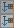

# Canvas and Workspace Layout

The Manager Block features an interactive flowchart design space. You can arrange components, adjust rendering depths, and clone or delete elements directly on the canvas.

---

## Graphical Workspace Layout

The interface uses a category-based sliding hover submenu overlay system, keeping creator nodes grouped under sidebar categories:

```
 0,0  ┌──────────────────────────────────────────────────────────────┐
      │[ ]  [D] [C] (X:22, Y:4) Utility Hotzones                     │
      │[T]  ┌──────────────────────────────────────────────────────┐ │
      │[I]  │ (X:22, Y:4)                                          │ │
      │[O]  │                                                      │ │
      │[L]  │         SLIDING OVERLAY SUBMENU (Hover)              │ │
      │[V]  │        ┌─────────────────────────┐                   │ │
      │[U]  │        │   [   Title Label   ]   │ (X:508)           │ │
      │     │        │ ┌───┐ ┌───┐ ┌───┐ ┌───┐ │                   │ │
      │     │        │ │   │ │   │ │   │ │   │ │                   │ │
      │     │        │ └───┘ └───┘ └───┘ └───┘ │         (Y:240)   │ │
      │     └────────┴─────────────────────────┴───────────────────┘ │
      │ Commands: 0                                                  │
      └──────────────────────────────────────────────────────────────┘
                                                                512,256
```

### Canvas Boundary Rules
All flowchart nodes are physically confined within the viewport boundary box. Drag-and-drop operations are clamped to:
*   **Minimum Workspace Bounds**: `X:22`, `Y:4`
*   **Maximum Workspace Bounds**: `X:508`, `Y:240`

---

## Adaptive GUI Scaling
To prevent UI clipping and overlapping on smaller displays, SFM-Flow implements adaptive scaling. If the window dimensions drop below the minimum required resolution (`512x256` pixels), the screen automatically reduces the game's GUI scale. When the interface is closed, your original GUI scale configuration is restored.

---

## Layering & Hardware Depth Testing

To prevent rendering errors where text, visual connectors, or selection submenus on lower layers bleed through higher elements, SFM-Flow utilizes hardware OpenGL depth testing:

*   **Z-Layer Sorting**: Clicking on a container automatically brings it to the top visual layer. The client assigns a higher layering rank (`zLevel`) and translates the rendering matrix along the Z-axis by `zLevel * 10.0F`.
*   **Instant Depth Flushing**: Each node container flushes its visual command batch to write directly to the GPU's hardware depth buffer before rendering adjacent elements. This helps maintain clean visual boundaries between overlapping components.

---

## Workspace Navigation & Controls

### 1. Left Sidebar Category Buttons
Positioned along the left sidebar starting at coordinate `X:4`. These represent logical node groups and are stacked vertically at `16px` intervals:

*   `[T]` **Trigger Category** (`Y:4`): Houses starting logic execution nodes (such as the periodic Interval Trigger).
    *   *Icon*: 
*   `[I]` **Input Category** (`Y:20`): Queries data or items from external blocks.
    *   *Icon*: 
*   `[O]` **Output Category** (`Y:36`): Pushes data or items into external blocks.
    *   *Icon*: 
*   `[L]` **Logic Category** (`Y:52`): Evaluates comparisons and branches execution paths.
    *   *Icon*: 
*   `[V]` **Variable Category** (`Y:68`): Manages local storage buffers, filters, and variables.
    *   *Icon*: 
*   `[U]` **Utility Category** (`Y:84`): Coordinates groups, signage, camouflage, and crafters.
    *   *Icon*: 

Hovering over any of these buttons opens a sliding submenu overlay aligned to the button's midpoint (`getX() + 7`). Moving your mouse cursor away closes the overlay.

---

### 2. Category Hover Submenu Overlays
When open, these sliding menus provide an active subgrid containing match-filtered spawner widgets:

*   **Visual Structure**: Features a custom 9-slice scaled border background (`submenu_bg.png`):
    
*   **Title Label**: Centered and dynamically scaled using automated text-ellipsis. Large titles scale down to a minimum of 40% scale factor (`0.4F`) to prevent clipping.
*   **Subgrid & Columns**: Sized dynamically from 1 to 4 columns wide depending on the count of active registered nodes.
*   **Scrolling System**: If a category holds more than 16 elements (exceeding a height of 56px), an interactive scrollbar is displayed on the right edge of the submenu:
    *   *Scroll track color*: Dark translucent (`0x40000000`)
    *   *Scroll thumb color*: Light gray (`0xFF8B8B8B`)
    *   Use your mouse scroll wheel over the submenu area to scroll vertically.
*   **Spawner Creation**: Hovering over any cell in the subgrid displays its translated display tooltip. Left-clicking on a cell spawns that node directly onto the canvas layout.

---

### 3. Header Utility Hotzones
Repositioning an active canvas node over either utility button and releasing the mouse click triggers specific actions:
*   `[D]` **Delete Hotzone**: Located at coordinates `X:22`, `Y:4`. Purges the node and any associated network wire connections.
    *   *Icon*: 
*   `[C]` **Copy Hotzone**: Located at coordinates `X:38`, `Y:4`. Clones the target node along with its internal settings, offsetting the copy by `+10px` on both axes to prevent direct overlapping.
    *   *Icon*: 

---

## Active Configuration Controls (Maximized Nodes)

When a component is expanded/maximized, its panel populates with interactive configuration controls. For example, expanding the periodic **Interval Trigger** node displays:

1.  **Time Unit Cycle Button**: Selects between `Ticks`, `Seconds`, or `Minutes` as the base duration scale. Clicking this button updates the time unit and scales the adjacent slider boundaries.
2.  **Duration Slider**: Click and drag this slider to configure the periodic execution interval.
    *   *Ticks range*: Clamped between `minIntervalTicks` (default `4`) and `100` ticks.
    *   *Seconds/Minutes range*: Clamped between `1` and `60` units.
    *   *Alternate Control*: Hover over the slider and use your mouse scroll wheel to increment or decrement the duration value precisely by `1` unit steps.

---

## Node Geometry Sizing

Nodes change dimensions based on whether they are minimized or maximized:

*   **Minimized Node Background** (`64x20px`): Used for compact viewing.
    *   *Texture File*: 
*   **Maximized Node Background** (`124x152px`): Expands the component to configure deeper internal settings.
    *   *Texture File*: 
*   **Interactive Node Sub-Widgets**:
    *   **Move Handle** (`6x6px`): Drag to reposition the node.
        *   *Texture File*: 
    *   **Toggle Expansion Arrow** (`11x12px` button bounds, `11x24px` texture sheet): Located on the top-right of a node. Click to minimize or maximize.
        *   *Texture File*: 
    *   **Logic Output Connection Node** (`6x6px` button bounds, `6x12px` texture sheet): Located on the bottom edge of output-capable components.
        *   *Texture File*: 

---

## Connector Spacing Offsets

The horizontal layout spacing of output pins dynamically adjusts according to the number of output paths (1 to 5):

```
  Minimized Layout (Base Width: 64px)
  ┌────────────────────────────────────────────────────────┐
  │ 1 Node:  [29]                                          │
  │ 2 Nodes: [15]       [43]                               │
  │ 3 Nodes: [4]        [29]        [54]                   │
  │ 4 Nodes: [5]   [21]      [37]   [53]                   │
  │ 5 Nodes: [3]  [16]  [29]  [42]  [55]                   │
  └────────────────────────────────────────────────────────┘

  Maximized Layout (Base Width: 124px)
  ┌────────────────────────────────────────────────────────┐
  │ 1 Node:  [59]                                          │
  │ 2 Nodes: [31]                   [87]                   │
  │ 3 Nodes: [14]                   [59]                   [104]  │
  │ 4 Nodes: [14]         [44]                [74]         [104]  │
  │ 5 Nodes: [12]      [35]         [59]          [83]     [106]  │
  └────────────────────────────────────────────────────────┘
```